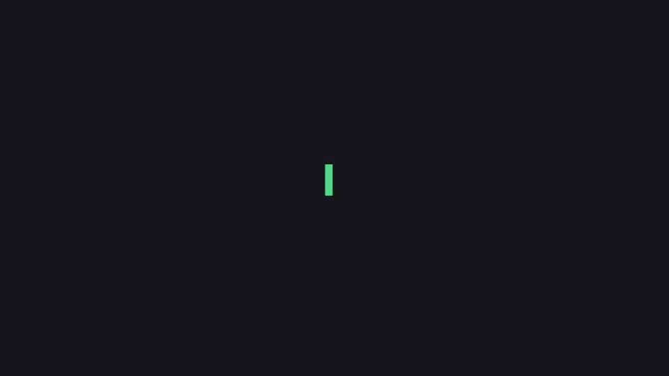

# CodeCouncil

[](https://github.com/adigo-tamu/CodeCouncil/actions/workflows/ci.yml)
[](LICENSE)



*Every line above is from a real run — the finding, the repro, the timings. Recreated frame-for-frame with [Remotion](https://remotion.dev) (`demo/`).*

**An AI peer reviewer for AI coding agents.** CodeCouncil watches your Claude
Code session in real time, pairs what the agent *says* it's doing with what
*actually changed*, and interrupts only when it can back a finding — ideally
with an executed repro. Then it grades its own performance against what you
did next, and rewrites its own review rules from the results.

The premise: AI coding agents are fast and confident, and their most common
failure isn't broken syntax — it's a **claim that isn't true**. "Handled the
edge case" (it didn't). "All tests pass" (they never ran). A docstring that
promises behavior the code doesn't have. Nobody reads the diff to check.
CodeCouncil is the second pair of eyes that does — a *differently-trained*
model, so it doesn't share your agent's blind spots.

```
you + Claude Code ──▶ transcripts + git ──▶ Observer ──▶ Critic ──▶ verified finding
                                                            │            │
                            heuristics rewrite ◀── Reflector ◀── hooks inject it into
                            (eval-gated, rolled            the agent's own context —
                             back on regression)           fix it or rebut it
```

## Sixty-second start

```sh
curl -fsSL https://raw.githubusercontent.com/adigo-tamu/CodeCouncil/main/install.sh | sh
```

That checks Python 3.10+, installs to `~/.codecouncil/app`, puts `codecouncil`
on your PATH, wires up [pi](https://pi.dev) (the model runtime) if npm is
available, and scaffolds `~/.codecouncil/env` for your key. Then:

```sh
echo 'NVIDIA_API_KEY=nvapi-...' >> ~/.codecouncil/env   # free — see "Model providers"
codecouncil /path/to/repo-you-code-in                   # hooks + all three loops
```

Re-run the installer to update. Prefer manual? `git clone` + `python3 -m
codecouncil /path/to/repo` works identically — the installer is convenience,
not magic ([install.sh](install.sh) is ~80 audited lines).

No pip installs — the loops are stdlib-only Python 3.10+. Findings appear in
your terminal, on the dashboard (`cd ui && npm install && npm run dev` →
localhost:4700), and — the important part — **inside your coding agent's own
context** via Claude Code hooks, scoped to the session that caused them.

## What makes it different

- **It screens for the failure modes research actually documents.** ~45% of
  AI code introduces OWASP-class vulnerabilities while syntax looks perfect
  (Veracode, 150+ models); models hallucinate nonexistent packages
  ("slopsquatting"); agents under pressure weaken their own tests. Every diff
  gets zero-cost mechanical screening for exactly these — SQL/command/eval
  injection patterns, unsafe deserialization, imports that don't resolve,
  removed tests and assertions — and the critic must confirm or dismiss each
  signal with a reason.
- **Findings arrive with receipts.** Before delivering, the critic writes and
  runs a repro against a staged copy of the flagged file. Refuted findings
  are never delivered; confirmed ones ship with the proof and a
  review-before-running repro command.
- **It grades its own silences.** Every verdict records what it reviewed.
  When a later fix commit revises files a PASS covered, that PASS is graded
  `missed` — and the judgment packet becomes a frozen eval case
  automatically. The eval set grows from real mistakes.
- **Self-improvement is measured and reversible, not vibes.** The Reflector
  rewrites the critic's rules from graded outcomes — but a candidate must
  match or beat the current rules on the frozen evals to ship, and a version
  whose real-world acceptance drops gets auto-rolled-back. Every finding
  cites the rule that motivated it, so rewrites are evidence-linked per rule.
- **Rebuttals become knowledge.** Your agent can push back
  (`COUNCIL-REBUTTAL: <reason>`) — recorded honestly, distilled into a
  per-repo facts file the critic reads on every future judgment. The same
  disagreement never needs to happen twice.
- **Council mode** (opt-in): a second, decorrelated model probes alongside
  the primary. The pairing is measured, not vibes — see
  [docs/benchmarks/](docs/benchmarks/): Nemotron (0 false positives, 2/4
  catches) anchors precision; `gpt-5-mini` (4/4 catches, 2 false positives)
  adds recall. A prober-only finding is delivered **only** with repro proof.
- **When your agent says "done", you get a session receipt** — claims made
  vs. mechanically verified facts (did a test command actually run?), written
  to `.codecouncil/receipts/` and announced in the transcript.

## Configuring — the two-terminal workflow

CodeCouncil is built to run beside your coding agent: `codecouncil .` in one
terminal, Claude Code in the other. The running council is interactive —
slash commands work in place, Claude Code-style:

```
/keys              guided API-key setup (hidden input, saved to ~/.codecouncil/env)
/model <p/m>       set + persist the primary model (restarts just the critic)
/prober <p/m|off>  council mode on/off (restarts just the critic)
/status            daemons, beats, last verdict, heuristics version, keys
/config            resolved configuration and where each value came from
```

Settings layer the way you'd expect: **CLI flag > environment variable
(`COUNCIL_MODEL` / `COUNCIL_PROBER`) > `~/.codecouncil/config.json`**. Keys
take effect on the next model call — no restarts. Piped/non-TTY runs skip the
console entirely and behave like a plain daemon.

The terminal is signal-first: idle-beat chatter is filtered (a dim summary
line keeps the pulse; `/verbose` unmutes), while the moments that matter —
findings, repro proofs, council votes, grades, heuristics rewrites, receipts
— arrive **★ highlighted**. The dashboard auto-starts when built
(`cd ui && npm install`, once) and announces its URL:
`[ui] dashboard ready → http://localhost:4700/`.

## Model providers

CodeCouncil talks to models through [pi](https://pi.dev), so **any provider
pi supports works** — put the provider's standard API key in
`~/.codecouncil/env` (or run `/keys` in the running council) and pick a
model with `/model provider/model-id` or `COUNCIL_MODEL`.

**The free option (recommended start): NVIDIA.** No credit card, no pi
login — NVIDIA hosts Nemotron and other open models with a free API key:

1. Go to [build.nvidia.com](https://build.nvidia.com) and sign in (any
   email works).
2. Open any model page and click **Get API Key** — it starts with
   `nvapi-`. (NVIDIA's own docs:
   [docs.api.nvidia.com](https://docs.api.nvidia.com/nim/reference/getting-started).)
3. `echo 'NVIDIA_API_KEY=nvapi-...' >> ~/.codecouncil/env` — with that key
   present and no model configured, CodeCouncil defaults to NVIDIA-hosted
   Nemotron automatically.

| Provider | Key in `~/.codecouncil/env` | Example `/model` value |
|---|---|---|
| NVIDIA (free) | `NVIDIA_API_KEY` | `nvidia-nim/nvidia/nemotron-3-super-120b-a12b` |
| OpenRouter | `OPENROUTER_API_KEY` | `openrouter/openai/gpt-5-mini` |
| OpenAI | `OPENAI_API_KEY` | `openai/gpt-5-mini` |
| Anthropic | `ANTHROPIC_API_KEY` | `anthropic/claude-haiku-4-5` |
| Google | `GEMINI_API_KEY` | `google/gemini-3-flash-preview` |
| Groq | `GROQ_API_KEY` | `groq/openai/gpt-oss-120b` |

The `nvidia-nim/…` and `openrouter/…` IDs above are the exact strings from
our [bake-off](docs/benchmarks/); for other providers, any model ID from
[pi's provider list](https://pi.dev/docs) works as `provider/model-id`.

One deliberate caveat: **prefer a critic from a different model family than
your coding agent** — the whole premise is a second pair of *differently
trained* eyes. If Claude Code writes your code, an Anthropic critic shares
its blind spots; Nemotron, GPT, or Gemini won't. (Council mode formalizes
this: `--prober openrouter/openai/gpt-5-mini` adds a decorrelated second
opinion, delivered only with repro proof.)

## Security model, in one paragraph

Everything is **redacted at capture** — credentials in diffs, new files,
commands, reasoning, or commit messages become `«REDACTED:kind»` markers
before any text is written to disk or built into a prompt (and the marker
itself is taught to the critic as a confirmed finding). The only thing that
leaves your machine is review prompts to the provider *you* configure; keys
live in `~/.codecouncil/env`, outside every repo. Repros run in throwaway
temp dirs; investigation tools are path-jailed to the repo. Full contract:
[SECURITY.md](SECURITY.md).

## Running the loops individually

```sh
python3 -m observer /path/to/repo        # event-driven; 10s fallback floor
python3 -m critic /path/to/repo          # 10s beat; model call only when code changed
python3 -m critic /path/to/repo --prober openrouter/openai/gpt-5-mini   # council mode
python3 -m reflector /path/to/repo       # grade + gated rewrites, every 5 min
python3 -m reflector.report /path/to/repo  # acceptance per heuristics version + per rule
python3 -m hooks.install /path/to/repo   # idempotent; peer_hook is fail-open
python3 -m evals.run /path/to/repo       # replay frozen cases against every rules version
```

Loops communicate **only through NDJSON files** in the watched repo's
`.codecouncil/` (gitignored) — each is independently restartable, crash-safe
(byte-offset cursors commit only after judgments durably land), and dies
never (missing inputs → wait). `COUNCIL_MODEL=provider/model` picks the
primary model; `CRITIC_CMD=<script>` stubs the model for tests.

## Honest numbers

From this repo's own dogfooding (it watches itself — the hooks are installed
here, and the critic reviews its builders):

- Plant-to-catch on a claim-vs-code bug: **~90 seconds**; catch-to-delivery
  into the agent's context: **~2 minutes**.
- It caught a real secret-leak bug **in its own redaction code** that two
  independent reviewers had approved.
- Model bake-offs across 12 candidates, 7 frozen cases each, latency and
  format discipline measured: [docs/benchmarks/](docs/benchmarks/).
- 627 tests (`python3 -m unittest discover -s tests`), CI on 3.10/3.12 +
  UI build + lint + installer smoke test + bench-selftest (the A/B harness's
  safety scorers prove they discriminate good from bad, zero API spend,
  before anyone trusts a live run). Small-n caveat: the self-improvement
  curves are days old, not months. That's what running it grows.
- The A/B harness's full method — arms, tiers, isolation, self-test gate,
  limitations, ponytail attribution — is written up in
  [docs/benchmarks/METHODOLOGY.md](docs/benchmarks/METHODOLOGY.md); no live
  multi-session run has been published under it yet.

## Contributing

See [CONTRIBUTING.md](CONTRIBUTING.md) — the eight invariants matter more
than any style guide. The whole dev loop is three commands: clone, `python3 -m unittest discover
-s tests` (stdlib-only — no venv, no pip install), and `CRITIC_CMD=<stub>`
to fake the model (see CONTRIBUTING.md's "Development loop").
Good first issues: redaction patterns, frozen eval
cases, adapters for other coding agents (the observer only needs an intent
stream; the hooks only need an injection channel).

Plain-language architecture tour: [docs/PROJECT_GUIDE.md](docs/PROJECT_GUIDE.md).
Design history: [docs/plans/](docs/plans/). License: [Apache-2.0](LICENSE).
